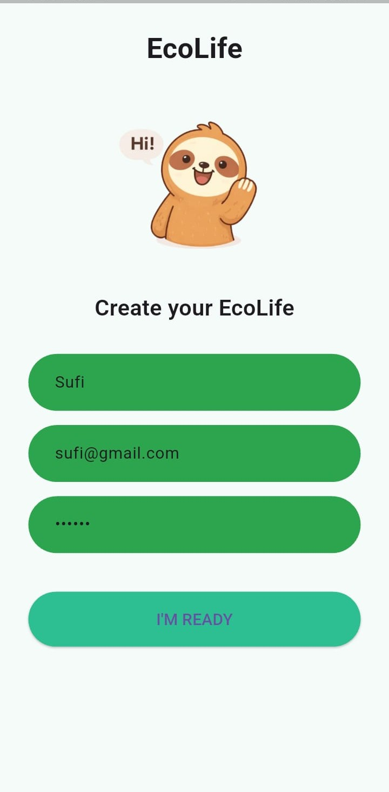
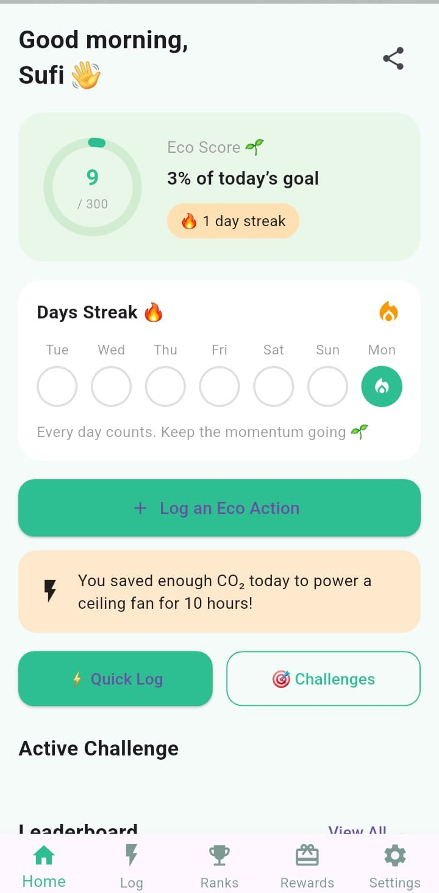
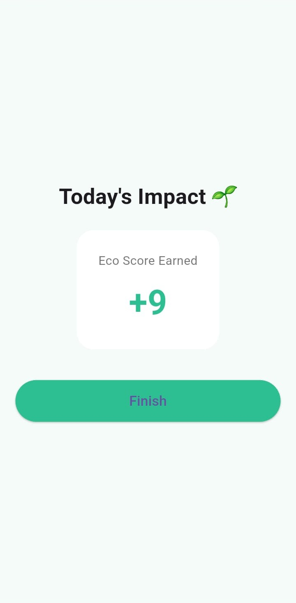
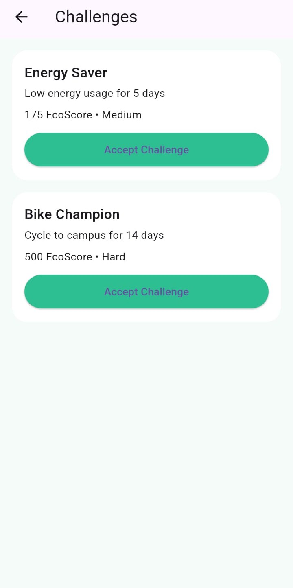
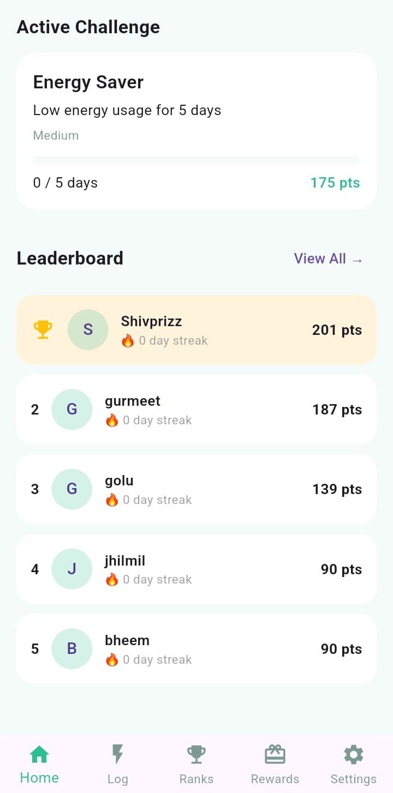
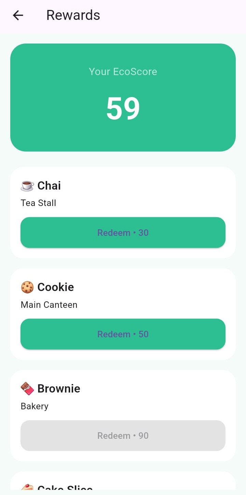

# EcoLife 🌱

A gamified carbon footprint tracker for students.
Built to turn everyday eco actions into habits through streaks, challenges, and rewards.

---

## What problem does EcoLife solve?

Most sustainability apps fail because they feel like lectures.
EcoLife flips the experience.

• No carbon jargon  
• No manual calculations  
• No guilt-based messaging  

Instead, students see **daily progress**, **instant feedback**, and **social motivation**.

---

## The EcoLife experience

### Onboarding that feels human

Users set their college, food preference, and basics once.
The app adapts impact scoring accordingly.

---

### A live daily EcoScore

• Daily goal
• Streak tracking
• Real-time eco feedback  
Everything updates instantly after an action.

---

### Log actions in seconds

No forms. No friction.
One tap logs a real-world choice like public transport or cycling.

---

### Measure Ecoscore

Measure ecoscore instantly based on log actions.

---

### Challenges that build habits

Multi-day challenges encourage consistency, not one-off actions.

---

### Social accountability through ranks

Leaderboards are campus-based to keep competition relevant and motivating.

---

### Rewards tied to real life

Eco points unlock small but tangible rewards like campus food perks.

---

## How EcoLife works (under the hood)

1. User logs an eco action
2. Action triggers EcoScore calculation in Firestore
3. Daily logs are stored per user
4. Provider updates UI in real time
5. Leaderboard syncs from the same EcoScore source

One action → one source of truth → instant feedback

---

## Tech stack

• Flutter  
• Firebase Authentication  
• Firestore  
• Provider state management  

Built mobile-first with a clean demo-friendly flow.

---

## Try EcoLife

📱 Android APK and 🎥 demo video available in **GitHub Releases**

Download, install, and explore without any setup.

---

## Project status

Hackathon demo build.
Core flows implemented end-to-end.
Designed for scalability to real campus deployments.
